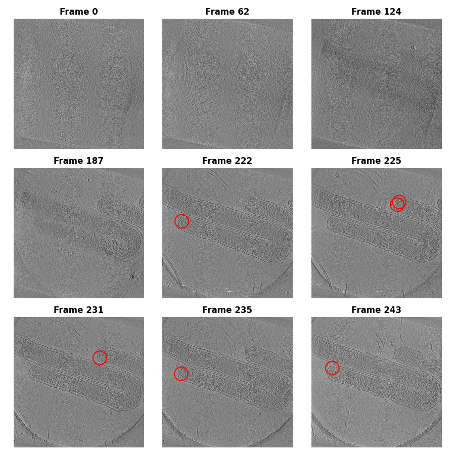

# AMLS_II_assignment24_25
## Project Overview
This project presents an automated approach to detect bacterial flagellar motors in cryogenic electron tomography (cryo-ET) data using deep learning methods. Bacterial flagellar motors are crucial molecular machines that enable bacterial motility and pathogenesis, traditionally identified through manual labor-intensive processes.

[This video](https://www.cellstructureatlas.org/6-2-flagellar-motor.html) walks through slices of a tomogram highlighting different features of a bacterial cell, including a flagellar motor. The accompanying text describes the purpose and function of the motor.

The implementation is part of the [BYU Locating Bacterial Flagellar Motors 2025](https://www.kaggle.com/competitions/byu-locating-bacterial-flagellar-motors-2025/overview) Kaggle competition.

The project explores two complementary deep learning approaches:

1. **YOLOv8 for 2D Detection**: Processes tomographic slice projections to identify and locate flagellar motors.
2. **3D UNet with Swin Transformer**: Performs full volumetric segmentation and localization to capture the complete spatial context.

## Dataset

The dataset consists of 3D tomograms of biological samples with labeled flagellar motor coordinates. Each tomogram is represented as a stack of 2D JPEG slices, forming a volumetric image. The coordinates specify the 3D position (x, y, z) of motors when present.



The image above shows a representative tomographic slice with flagellar motors visible as distinctive structures. 

## Results

| Model | Precision | Recall | F₂-Score |
|-------|-----------|--------|----------|
| YOLOv8 | 0.86 | 0.85 | 0.8 |
| Swin UNETR | 0.65 | 0.63 | 0.6 |

The YOLOv8 model provided faster processing times, while the 3D approach offered a more complete spatial context.


The animation above demonstrates the detection process across multiple tomographic slices, showing how our models identify flagellar motors in 3D space.

## File Descriptions
```markdown
├── main.py                         # Main entry point for running experiments
├── pyproject.toml                  # Project configuration and dependencies
├── uv.lock                         # Dependency lock file for package versions
├── src/                            # Source code directory
│   ├── imports.py                  # Common imports used across the project
│   ├── config/                     # Configuration files
│   ├── data/                       # Data processing modules
│   ├── models/                     # Model definitions and implementations
for UNet training
│   ├── scripts/                    # Utility scripts for various tasks
│   └── utils/                      # Helper functions and utilities
│
├── Datasets/                       # Data storage directory
│   ├── 3dunet_dataset/             # Dataset prepared for 3D UNet
│   ├── 3dunet_dataset_heatmap/     # Heatmap representation dataset for 3D UNet
│   ├── byu-locating-bacterial-flagellar-motors-2025/  # Original competition dataset
│   │   ├── train/                  # Training tomograms
│   │   ├── test/                   # Test tomograms for submission
│   │   ├── train_labels.csv        # Ground truth coordinates for training
│   │   └── sample_submission.csv   # Sample submission format
│   └── yolo_dataset/               # Dataset prepared for YOLOv8
│
├── outputs/                        # Results and output files
│   ├── 3dunet/                     # 3D UNet model results
│   ├── data_description/           # Data analysis results
│   ├── motor_visualization/        # Visualizations of detected motors
│   ├── predict_samples/            # Sample predictions for evaluation
│   ├── submissions/                # Competition submission files
│   └── tomo_gif/                   # GIF visualizations of tomographic slices
│
|── reference/                      # Reference materials and notebooks
```

## Run the project
### Clone the Repository

To get started, clone the repository to your local machine:

```bash
git clone https://github.com/yushiran/AMLS_II_assignment24_25.git
cd AMLS_II_assignment24_25
```


You can set up the environment using the following steps:
### Using uv (Recommended) and create virtual environment

```bash
# Install uv if you don't have it already
pip install uv

# Create and activate a virtual environment
uv venv .venv
source .venv/bin/activate  # On Windows: .venv\Scripts\activate
```
### Using uv.lock (Recommended)
```bash
uv pip install -r uv.lock # Install dependencies from lock file (for reproducible environment)
```

### or Install dependencies using pyproject.toml
```bash
uv pip install . # Install dependencies using pyproject.toml (automatically generates uv.lock)
```
### Required Dependencies

The main dependencies for this project include:
- PyTorch (>=1.10.0)
- MONAI (>=1.0.0) for medical image handling
- Ultralytics for YOLOv8 implementation
- Nibabel for 3D medical image formats
- NumPy, Pandas, and SciPy for data manipulation
- Matplotlib and Plotly for visualization

Note: For GPU acceleration, ensure you have CUDA installed if using NVIDIA GPUs.

### Download the dataset form kaggle
```markdown
To download the dataset, follow these steps:

1. Visit the [Kaggle competition page](https://www.kaggle.com/competitions/byu-locating-bacterial-flagellar-motors-2025/overview).
2. Log in to your Kaggle account.
3. Navigate to the "Data" tab on the competition page.
4. Download the dataset files manually to your local machine.
5. Extract the downloaded files into the `Datasets/` directory of the project.
```

### Edit config file, fix the base project file path
```yaml
Edit the `src/config/config.yaml` file to update the `paths` section:

paths:
  base_dir: 'your project abs file path'
```

### UV run the main.py

```bash
uv run main.py
```

This script performs the following steps:
1. **Data Preprocessing**: Prepares the dataset for analysis by cleaning and transforming the data as needed.
2. **Inference on Test Set**: Runs inference on the test dataset to generate predictions.
3. **Visualization of Results**: Produces visualizations to help interpret and analyze the inference results.
